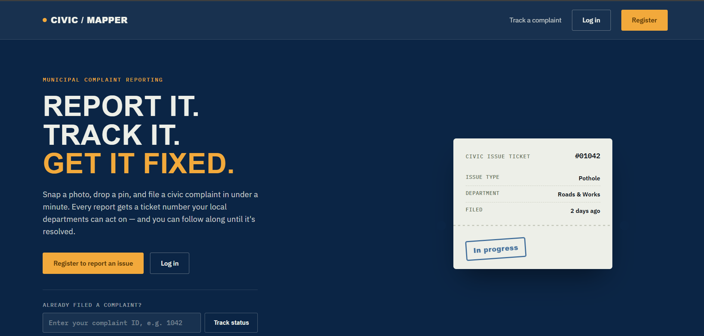
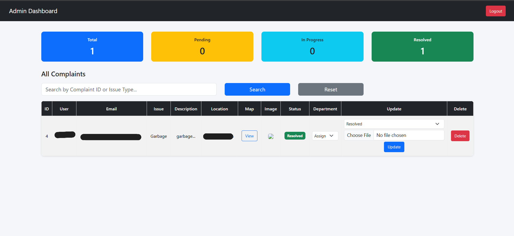

<div align="center">


</div>

---

## 📌 About

A government-style civic issue reporting portal where citizens can report problems like garbage dumping, broken roads, water leakage, and street light failures — with photo and GPS evidence — and track resolution status. Authorities manage and resolve issues through an admin dashboard with live statistics and department routing.

Aligned with **UN Sustainable Development Goal 11: Sustainable Cities and Communities**.

---

## 🌐 Live Demo

The application is deployed and live at: **[https://ai-civic-issue-mapper.onrender.com](https://ai-civic-issue-mapper.onrender.com)**

**Tech used for deployment:**
- **Hosting:** Render (Free tier)
- **Database:** Aiven for MySQL (Free tier)
- **Email delivery:** Brevo API (bypasses Render's free-tier SMTP restrictions)
- **Uptime:** Monitored via UptimeRobot pinging a `/healthz` endpoint every 5 minutes

---

## ✨ Features

| Feature | Status |
|---------|--------|
| Landing page (public, pre-login) | ✅ Done |
| User Registration & Login | ✅ Done |
| Google OAuth Login | ✅ Done |
| Secure password hashing (citizens + admin) | ✅ Done |
| Report Issue with Image & Location | ✅ Done |
| Admin Dashboard | ✅ Done |
| Dashboard Statistics | ✅ Done |
| Search & Filter Complaints | ✅ Done |
| Department Assignment | ✅ Done |
| Complaint Status Tracking | ✅ Done |
| Resolution Proof Photo Upload | ✅ Done |
| Single Complaint Map View (Leaflet.js) | ✅ Done |
| Email Validation & Password Rules | ✅ Done |
| Forgot / Reset Password (Email Verification) | ✅ Done |
| Rate Limiting | ✅ Done |
| Custom 404 / 500 / 429 Error Pages | ✅ Done |
| Mobile Responsive Design | ✅ Done |
| Citizen Feedback System | ✅ Done |
| Notification System | ✅ Done |
| Public Complaint Status Tracker (No Login) | ✅ Done |
| Full Multi-Complaint Map View (color-coded pins) | 🚧 In Progress |
| AI Image Classification (Teachable Machine) | ⏳ Planned |
| SLA / Auto-Escalation | ⏳ Planned |

---

## 🛠️ Tech Stack

| Layer | Technology |
|-------|-----------|
| Backend | Python, Flask |
| Database | MySQL (Aiven) |
| Frontend | HTML, CSS, Bootstrap |
| Authentication | Flask-Dance, Google OAuth, Werkzeug password hashing |
| Security | Werkzeug, python-dotenv, Flask-Limiter |
| Email | Brevo API |
| Maps | Leaflet.js |
| Deployment | Render, Gunicorn |
| Uptime Monitoring | UptimeRobot |

---

## 📁 Project Structure
ai-civic-issue-mapper/

├── static/

│   ├── uploads/        ← complaint & resolution images

│   └── style.css

├── templates/

│   ├── landing.html

│   ├── login.html

│   ├── register.html

│   ├── form.html

│   ├── my_issues.html

│   ├── admin.html

│   ├── admin_login.html

│   ├── notifications.html

│   ├── forgot_password.html

│   ├── reset_password.html

│   ├── track_status.html

│   ├── view_map.html

│   ├── 404.html

│   ├── 500.html

│   ├── 429.html

│   └── success.html

├── docs/

│   └── test_report.html

├── .env                ← credentials (not on GitHub)

├── .gitignore

├── app.py              ← main backend

├── Procfile             ← Render deployment config

├── LICENSE

└── requirements.txt

---

## 🚀 How to Run

**1. Clone the repository**
```bash
git clone https://github.com/Anushka190921/ai-civic-issue-mapper.git
cd ai-civic-issue-mapper
```

**2. Install dependencies**
```bash
pip install -r requirements.txt
```

**3. Create .env file**
SECRET_KEY=your_secret_key

DB_HOST=localhost

DB_USER=root

DB_PASSWORD=your_password

DB_NAME=civic_issues

GOOGLE_CLIENT_ID=your_google_client_id

GOOGLE_CLIENT_SECRET=your_google_client_secret

MAIL_USERNAME=your_email

BREVO_API_KEY=your_brevo_api_key


**4. Run the app**
```bash
python app.py
```

**5. Open browser**
http://127.0.0.1:5000

---

## 📸 Screenshots

| Landing Page | Login |
|--------------|-------|
|  |  |

| Register | Report Issue |
|----------|--------------|
|  |  |

| Admin Dashboard | My Complaints |
|-----------------|--------------|
|  |  |

| Track Complaint Status | Success Page |
|-------------------------|--------------|
|  |  |

---

## 👥 Team

| Role | Name | GitHub |
|------|------|--------|
| 👑 Project Lead & Backend Developer | Anushka | [Anushka190921](https://github.com/Anushka190921) |
| 🎨 Frontend Developer | Kanishka | [Kanishka240306](https://github.com/Kanishka240306) |
| 🔗 API / Testing / Integration | Anushka srivastava | [Anushka504-S](https://github.com/Anushka504-S) |

---

## 🔮 Roadmap

- 🗺️ Full multi-complaint map view (all complaints as color-coded pins)
- 🤖 AI Image Classification
- ⏰ SLA / Auto-Escalation
- 📊 Analytics Dashboard

---

<div align="center">

**⭐ If you find this project useful, please star the repository!**


</div>