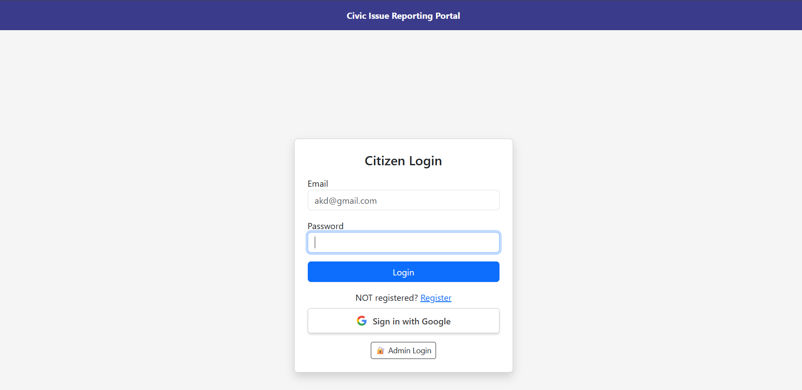
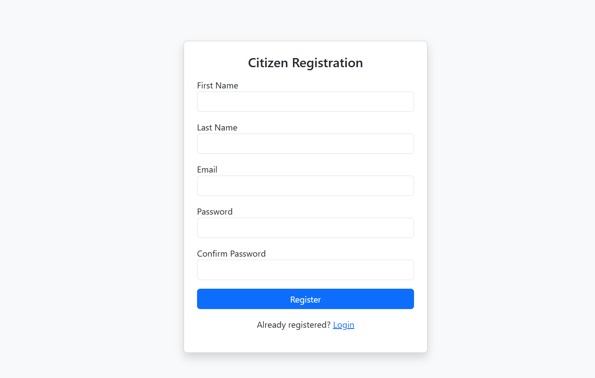
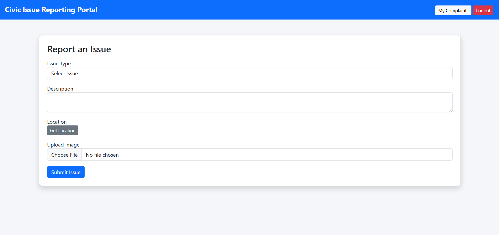
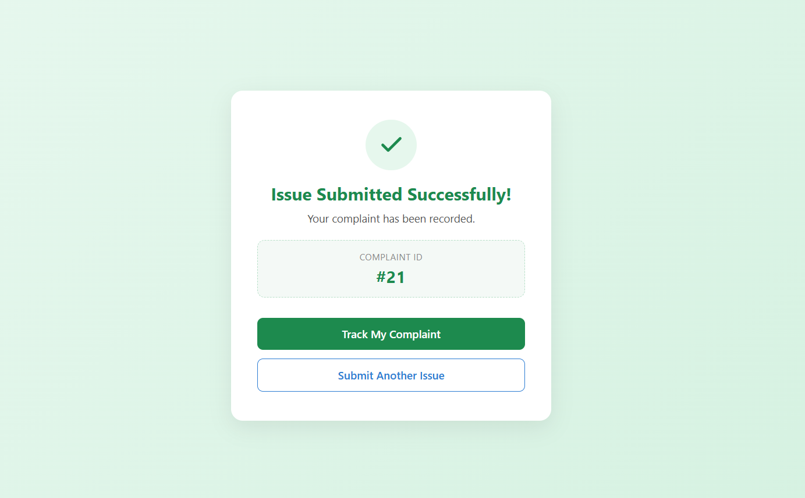
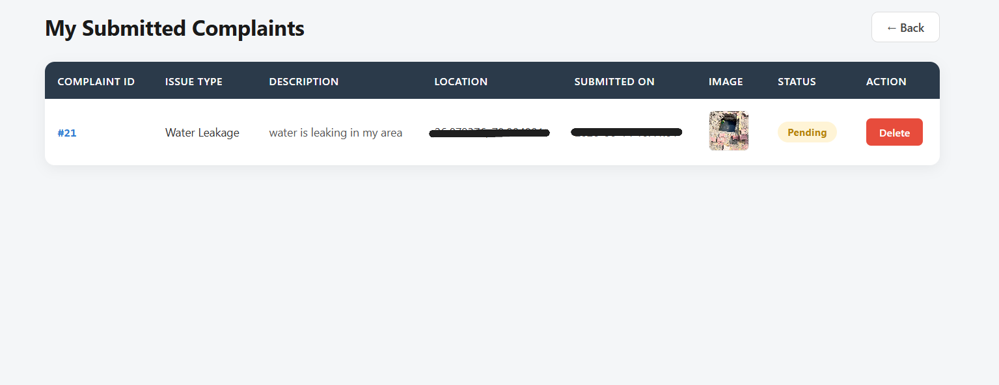

<div align="center">


</div>

---

## 📌 About

A government-style civic issue reporting portal where citizens can report problems like garbage dumping, broken roads, water leakage, and street light failures. Authorities can track, manage, and resolve issues efficiently while keeping citizens informed.

---

## ✨ Features

| Feature | Status |
|---------|--------|
| User Registration & Login | ✅ Done |
| Google OAuth Login | ✅ Done |
| Report Issue with Image & Location | ✅ Done |
| Admin Dashboard | ✅ Done |
| Complaint Status Tracking | ✅ Done |
| Email Validation & Password Rules | ✅ Done |
| AI Image Classification | ⏳ Coming Soon |
| Map Visualization | ⏳ Coming Soon |
| Notification System | ⏳ Coming Soon |

---

## 🛠️ Tech Stack

| Layer | Technology |
|-------|-----------|
| Backend | Python, Flask |
| Database | MySQL |
| Frontend | HTML, CSS, Bootstrap |
| Authentication | Flask-Dance, Google OAuth |
| Security | Werkzeug, python-dotenv |

---

## 📁 Project Structure
ai-civic-issue-mapper/

├── static/

│   ├── uploads/        ← complaint images

│   └── style.css

├── templates/

│   ├── login.html

│   ├── register.html

│   ├── form.html

│   ├── my_issues.html

│   ├── admin.html

│   ├── admin_login.html

│   └── success.html

├── .env                ← credentials (not on GitHub)

├── .gitignore

├── app.py              ← main backend

└── requirements.txt

---

## 🚀 How to Run

**1. Clone the repository**
```bash
git clone https://github.com/Anushka190921/ai-civic-issue-mapper.git
cd ai-civic-issue-mapper
```

**2. Install dependencies**
```bash
pip install -r requirements.txt
```

**3. Create .env file**
SECRET_KEY=your_secret_key

DB_HOST=localhost

DB_USER=root

DB_PASSWORD=your_password

DB_NAME=civic_issues

GOOGLE_CLIENT_ID=your_google_client_id

GOOGLE_CLIENT_SECRET=your_google_client_secret


**4. Run the app**
```bash
python app.py
```

**5. Open browser**
http://127.0.0.1:5000

---

## 📸 Screenshots

| Login | Register |
|-------|----------|
|  |  |

| Report Issue | Success Page |
|-------------|--------------|
|  |  |

| My Complaints |
|--------------|
|  |


## 👥 Team

| Role | Name | GitHub |
|------|------|--------|
| 👑 Project Lead & Backend Developer | Anushka | [Anushka190921](https://github.com/Anushka190921) |
| 🎨 Frontend Developer | Kanishka | [Kanishka240306](https://github.com/Kanishka240306) |
| 🔗 API / Testing / Integration | Coming Soon | - |

---

## 🔮 Coming Soon

- 🤖 AI Image Classification
- 🗺️ Map Visualization (Leaflet.js)
- 🔔 Notification System
- 📊 Analytics Dashboard
- 💬 Citizen Feedback System

---

<div align="center">

**⭐ If you find this project useful, please star the repository!**


</div>