<div align="center">


</div>

---

## 📌 About

A civic issue reporting portal where citizens report problems like garbage dumping, broken roads, water leakage, and street light failures — with photo and GPS evidence — and track resolution through to completion. Departments get automatic routing, priority-sorted queues, and measurable SLA accountability. Citizens get real-time duplicate detection, transparent public stats, and status tracking with no account required.

Aligned with **UN Sustainable Development Goal 11: Sustainable Cities and Communities**.

---

## 🌐 Live Demo

The application is deployed and live at: **[https://ai-civic-issue-mapper.onrender.com](https://ai-civic-issue-mapper.onrender.com)**

**Tech used for deployment:**
- **Hosting:** Render (Free tier)
- **Database:** Aiven for MySQL (Free tier)
- **Email delivery:** Brevo API (bypasses Render's free-tier SMTP restrictions)
- **Uptime:** Monitored via UptimeRobot pinging a `/healthz` endpoint every 5 minutes

---

## ✨ Features

| Feature | Status |
|---------|--------|
| Landing page (public, pre-login) | ✅ Done |
| User Registration & Login | ✅ Done |
| Google OAuth Login | ✅ Done |
| Secure password hashing (citizens + admin) | ✅ Done |
| Report Issue with Image & GPS Location | ✅ Done |
| Severity / urgency self-rating (Low–Critical) | ✅ Done |
| Automatic department routing by category | ✅ Done |
| Real-time duplicate detection (GPS + text similarity) | ✅ Done |
| Admin Dashboard with live stats | ✅ Done |
| Priority-based sorting (urgency + newest) | ✅ Done |
| Search & Filter Complaints | ✅ Done |
| Manual department reassignment | ✅ Done |
| Complaint Status Tracking | ✅ Done |
| Resolution Proof Photo Upload | ✅ Done |
| SLA tracking with per-category targets & overdue flagging | ✅ Done |
| Public Transparency Page (stats, SLA compliance, no login) | ✅ Done |
| Single Complaint Map View (Leaflet.js) | ✅ Done |
| Email Validation & Password Rules | ✅ Done |
| Forgot / Reset Password (Email Verification) | ✅ Done |
| Rate Limiting | ✅ Done |
| Custom 404 / 500 / 429 Error Pages | ✅ Done |
| Mobile Responsive Design | ✅ Done |
| Citizen Feedback System | ✅ Done |
| Notification System | ✅ Done |
| Public Complaint Status Tracker (No Login) | ✅ Done |
| Full Multi-Complaint Map View (color-coded pins) | 🚧 In Progress |
| Geo-spatial Heatmaps | ⏳ Planned (depends on map view above) |
| AI Image Classification | ⏳ Planned |

---

## 🛠️ Tech Stack

| Layer | Technology |
|-------|-----------|
| Backend | Python, Flask |
| Database | MySQL (Aiven) |
| Frontend | HTML, CSS, JavaScript — custom navy & amber design system |
| Authentication | Flask-Dance, Google OAuth, Werkzeug password hashing |
| Security | Werkzeug, python-dotenv, Flask-Limiter |
| Duplicate detection | Haversine GPS-distance calculation, Python `difflib` text similarity |
| Email | Brevo API |
| Maps | Leaflet.js |
| Deployment | Render, Gunicorn (deployed via `git push`, no CI/CD pipeline) |
| Uptime Monitoring | UptimeRobot |

---

## 📁 Project Structure
ai-civic-issue-mapper/

├── static/

│   ├── uploads/        ← complaint & resolution images

│   └── style.css

├── templates/

│   ├── landing.html

│   ├── login.html

│   ├── register.html

│   ├── form.html

│   ├── my_issues.html

│   ├── admin.html

│   ├── admin_login.html

│   ├── notifications.html

│   ├── forgot_password.html

│   ├── reset_password.html

│   ├── track_status.html

│   ├── transparency.html

│   ├── view_map.html

│   ├── 404.html

│   ├── 500.html

│   ├── 429.html

│   └── success.html

├── docs/

│   └── test_report.html

├── .env                ← credentials (not on GitHub)

├── .gitignore

├── app.py              ← main backend

├── Procfile             ← Render deployment config

├── LICENSE

└── requirements.txt

---

## 🚀 How to Run

**1. Clone the repository**
```bash
git clone https://github.com/Anushka190921/ai-civic-issue-mapper.git
cd ai-civic-issue-mapper
```

**2. Install dependencies**
```bash
pip install -r requirements.txt
```

**3. Create .env file**
SECRET_KEY=your_secret_key

DB_HOST=localhost

DB_USER=root

DB_PASSWORD=your_password

DB_NAME=civic_issues

GOOGLE_CLIENT_ID=your_google_client_id

GOOGLE_CLIENT_SECRET=your_google_client_secret

MAIL_USERNAME=your_email

BREVO_API_KEY=your_brevo_api_key


**4. Set up the database schema**

Run this migration to add the columns needed for severity scoring and SLA tracking:
```sql
ALTER TABLE civic_issues ADD COLUMN urgency VARCHAR(20) DEFAULT 'Medium';
ALTER TABLE civic_issues ADD COLUMN updated_at DATETIME NULL;
```

**5. Run the app**
```bash
python app.py
```

**6. Open browser**
http://127.0.0.1:5000

---

## 🎯 How Severity, Routing & SLA Work Together

1. A citizen files a complaint and self-rates its urgency (Low / Medium / High / Critical).
2. Before submitting, the system checks for likely duplicate reports nearby (GPS proximity + text similarity) and prompts the citizen to confirm an existing report instead of filing a new one.
3. The complaint is automatically routed to the correct department based on its category.
4. Each category carries a target resolution time — Garbage: 2 days, Water Leakage: 3 days, Street Lights: 5 days, Potholes: 7 days.
5. The admin dashboard surfaces the highest-priority and SLA-overdue complaints first.
6. Once resolved, the public transparency page reflects the real resolution rate, average time to fix, and SLA compliance percentage — no login required to view it.

---

## 📸 Screenshots

**Landing Page**

| | | |
|---|---|---|
| 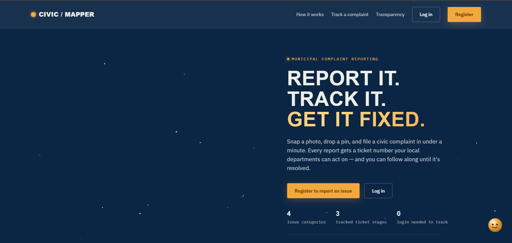 | 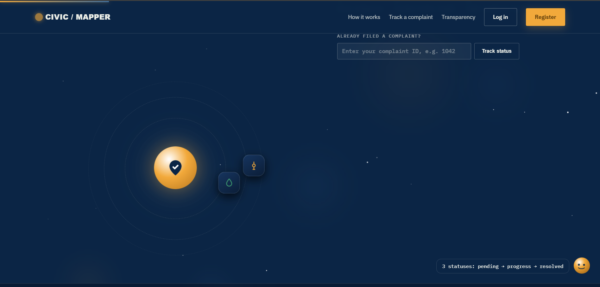 | 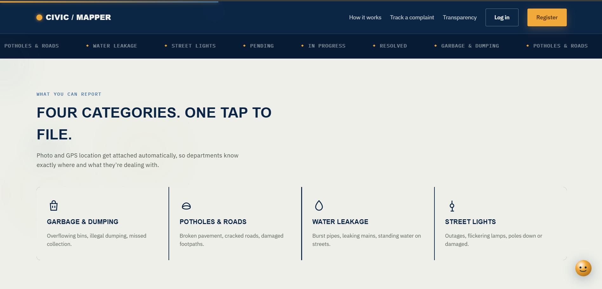 |
| 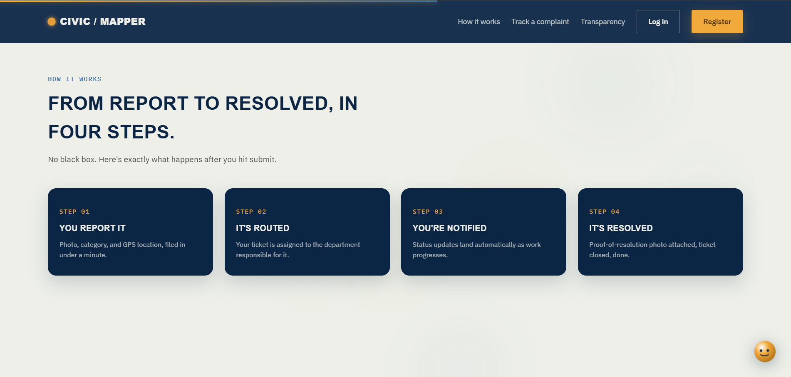 | 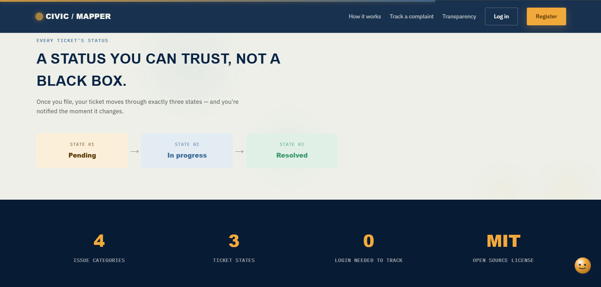 | 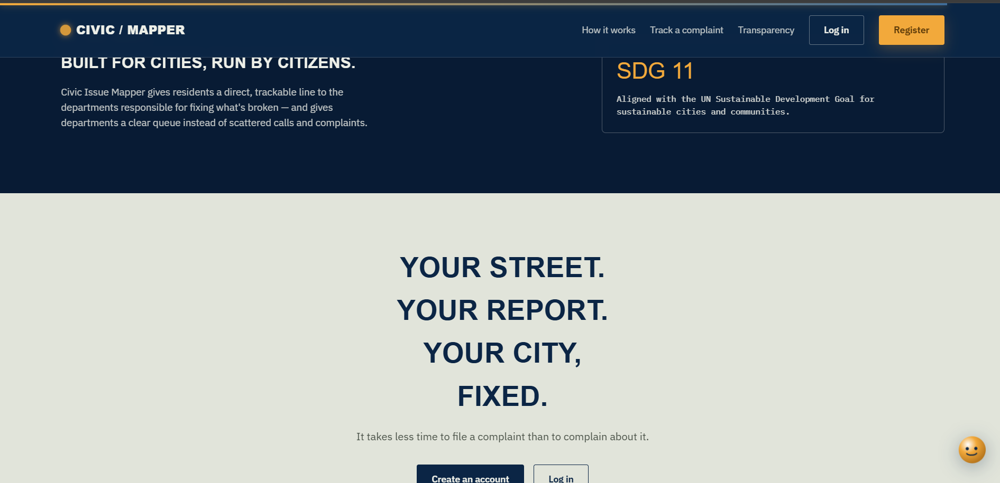 |

**Core App Pages**

| Login | Register |
|-------|----------|
| 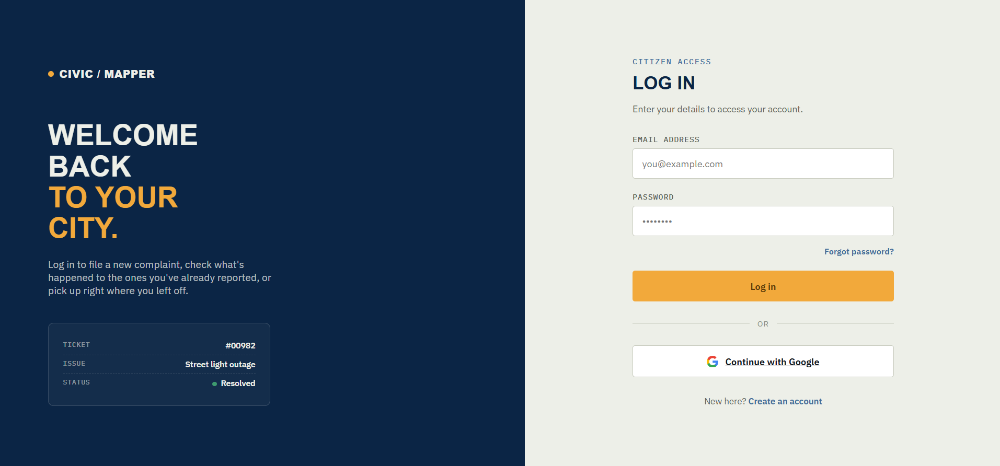 | 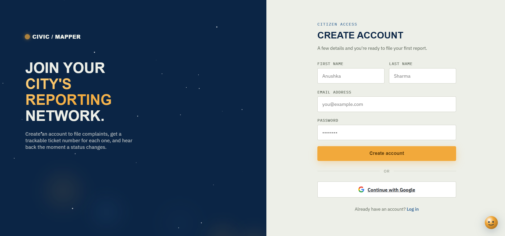 |

| Report Issue | Admin Dashboard |
|--------------|------------------|
| 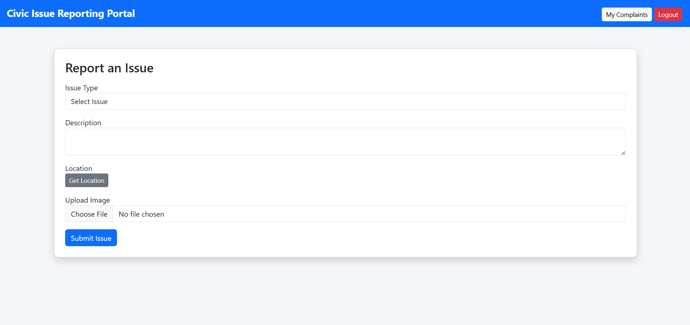 | 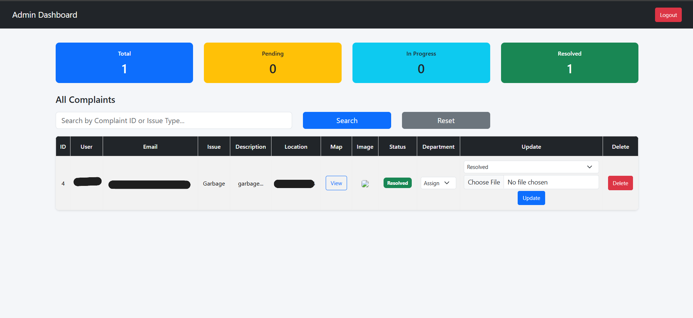 |

| Transparency Page | Transparency Page (scrolled) |
|--------------------|-------------------------------|
| 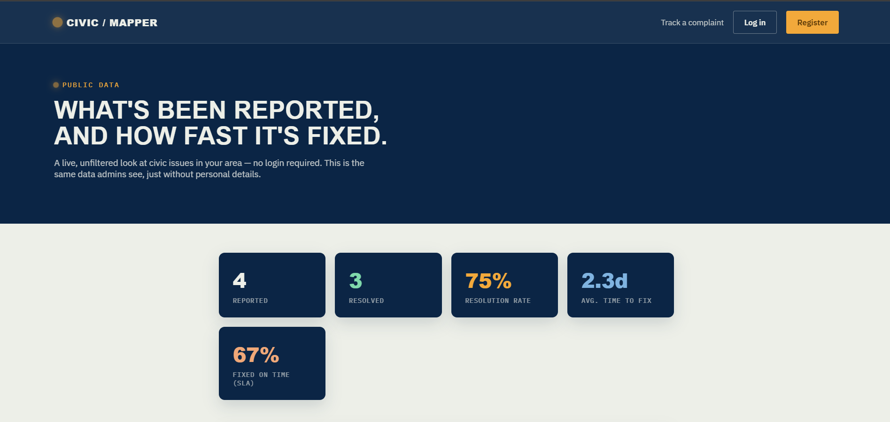 | 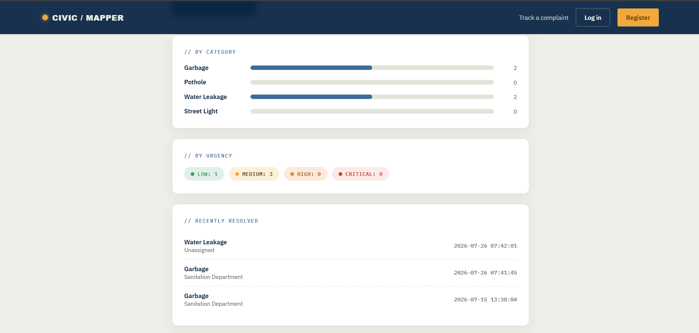 |

| Track Complaint Status | My Issues |
|-------------------------|-----------|
| 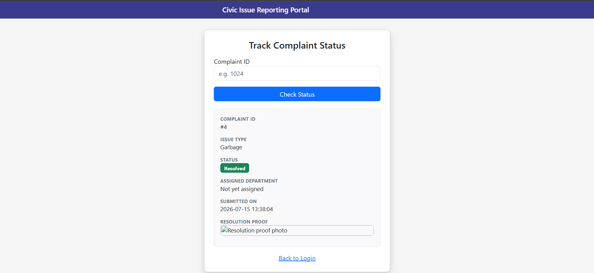 | 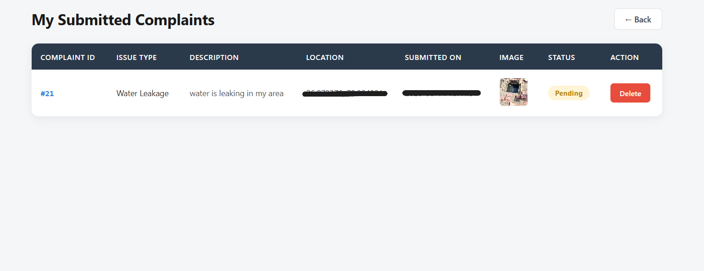 |

---

## 👥 Team

| Role | Name | GitHub |
|------|------|--------|
| 👑 Project Lead & Backend Developer | Anushka | [Anushka190921](https://github.com/Anushka190921) |
| 🎨 Frontend Developer | Kanishka | [Kanishka240306](https://github.com/Kanishka240306) |
| 🔗 API / Testing / Integration | Anushka Srivastava | [Anushka504-S](https://github.com/Anushka504-S) |

---

## 🔮 Roadmap

- 🗺️ Full multi-complaint map view (all complaints as color-coded pins)
- 🌡️ Geo-spatial heatmaps of issue hotspots by ward/neighborhood
- 🤖 AI image classification for automatic category detection

---

## ⚠️ Known Limitations

Being upfront about what this project currently does *not* have:
- No CI/CD pipeline or automated test suite — deployment is a manual `git push` to Render
- No SMS or WhatsApp reporting channel — web only
- AI image classification is planned but not yet implemented, despite the project name

---

<div align="center">

**⭐ If you find this project useful, please star the repository!**


</div>